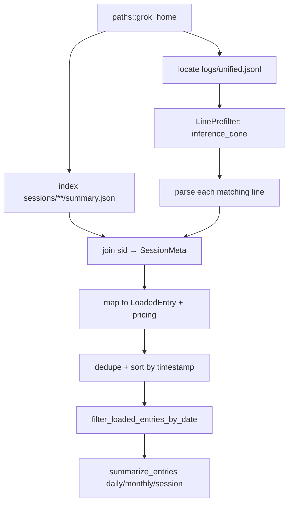

# Plan: Add Grok Build CLI support to ccusage

## Context

ccusage is a Rust-first CLI (`rust/crates/ccusage`) that reports token usage and estimated cost from local agent session data. Each supported agent has an adapter under `rust/crates/ccusage/src/adapter/<agent>/` with path discovery, parsing, loading, and report shaping.

[Grok Build CLI](https://github.com/xai-org/grok-cli) (and Grok-in-Cursor via the same runtime) stores session metadata under `~/.grok/sessions/` but **does not persist per-inference input/output token breakdown in session JSONL files**. Billable usage is recorded in the global structured log `~/.grok/logs/unified.jsonl` as `shell.turn.inference_done` events keyed by session ID (`sid`).

This plan adds a `grok` agent subcommand (`ccusage grok daily|monthly|session`) using a **hybrid loader**: parse `unified.jsonl` for tokens, index `sessions/**/summary.json` for cwd/model/title metadata.

### Decisions from investigation

| Decision | Choice | Rationale |
|----------|--------|-----------|
| Primary token source | `logs/unified.jsonl` | Only source with `prompt_tokens`, `cached_prompt_tokens`, `completion_tokens`, `reasoning_tokens` per inference |
| Session metadata source | `sessions/<encoded-cwd>/<id>/summary.json` | Provides `info.cwd`, `current_model_id`, title, timestamps |
| Do not parse `chat_history.jsonl` for usage | Skip | Assistant lines have `model_id` but no usage fields |
| Granularity | One `LoadedEntry` per `inference_done` | Matches Copilot OTEL per-span model; accurate for multi-tool turns |
| Cost mode | Calculate / Auto only | No precomputed `costUSD` in local Grok data |
| V1 scope | Primary sessions only | `subagent_finished.tokens_used` lacks input/output split; defer |
| Command name | `grok` | Aligns with `ccusage kimi`, `ccusage codex`; matches product name |
| All-agents report | Include in V1 | Kimi/Copilot are in `adapter/all/loader.rs`; Grok should be too |

### Non-goals (V1)

- Parsing `updates.jsonl` ACP stream for usage (no token fields on `turn_completed`)
- Subagent `tokens_used` aggregates from `subagent_finished`
- User-turn rollup (combining multiple `loop_index` inferences into one row per prompt)
- Reading Grok remote billing APIs
- npm/TypeScript runtime adapter logic (Rust-only per repo policy)

---

## Data model

### Grok on-disk layout

```text
${GROK_HOME:-~/.grok}/
├── logs/
│   └── unified.jsonl          # append-only structured log (primary token source)
└── sessions/
    └── <url-encoded-cwd>/     # e.g. %2Fhome%2Fshuv%2Frepos%2Fccusage
        └── <session-uuid>/
            ├── summary.json     # session index metadata
            ├── updates.jsonl    # ACP updates (not used for tokens in V1)
            ├── chat_history.jsonl
            ├── events.jsonl
            └── signals.json     # session-level context totals only
```

Override base directory with `GROK_HOME` (documented in Grok user guide `17-sessions.md`, `05-configuration.md`).

### `shell.turn.inference_done` record (authoritative)

Observed shape from live `~/.grok/logs/unified.jsonl`:

```json
{
  "ts": "2026-06-26T23:19:24.708Z",
  "src": "shell",
  "sid": "019f063a-df04-7f23-9879-099c7432a236",
  "msg": "shell.turn.inference_done",
  "ctx": {
    "loop_index": 1,
    "prompt_tokens": 21587,
    "cached_prompt_tokens": 7623,
    "completion_tokens": 230,
    "reasoning_tokens": 0
  }
}
```

Notes:

- `loop_index` resets to `1` on each new user prompt within a session.
- One user turn with multiple tool rounds produces many `inference_done` lines.
- `sid` may be absent on non-session log lines; skip those.

### `summary.json` record (session index)

```json
{
  "info": {
    "id": "019f063a-df04-7f23-9879-099c7432a236",
    "cwd": "/home/shuv/repos/ccusage"
  },
  "current_model_id": "grok-composer-2.5-fast",
  "generated_title": "Grok CLI Session Data Storage Location",
  "created_at": "2026-06-26T23:19:09.324182065Z",
  "updated_at": "2026-06-26T23:20:50.770102204Z"
}
```

Fallback when summary is missing: use URL-decoded parent directory name from sessions path only for project hint; model defaults to `grok-build` with `missing_pricing_model` if unpriced.

### Token mapping → `TokenUsageRaw`

| Grok `ctx` field | ccusage field | Notes |
|------------------|---------------|-------|
| `prompt_tokens - cached_prompt_tokens` | `input_tokens` | Uncached prompt tokens |
| `cached_prompt_tokens` | `cache_read_input_tokens` | Prompt cache hits |
| `completion_tokens + reasoning_tokens` | `output_tokens` | Sum both |
| — | `cache_creation_input_tokens` | `0` (not exposed locally) |

### Model naming and pricing lookup

Display model: `[grok] {current_model_id}` (e.g. `[grok] grok-composer-2.5-fast`).

Pricing candidate order (new helper in `parser.rs`, patterned after `rust/crates/ccusage/src/adapter/droid/parser.rs`):

1. Raw `current_model_id` (`grok-composer-2.5-fast`)
2. `xai/{model}` (`xai/grok-composer-2.5-fast`)
3. `openrouter/x-ai/{model}` if applicable
4. Embedded fallback `grok-4.3` only when no LiteLLM match (existing in `rust/crates/ccusage/src/pricing.rs`)

Verify LiteLLM snapshot includes composer/build variants; add embedded overrides in `pricing.rs` if offline reports show `missing_pricing_model` for common Grok models.

### Dedup key

```text
grok:{sid}:{ts}:{loop_index}:{prompt_tokens}:{completion_tokens}:{cached_prompt_tokens}
```

Stable across re-reads; avoids double-counting if log is scanned twice.

---

## Architecture

### Module layout

Create `rust/crates/ccusage/src/adapter/grok/`:

| File | Responsibility |
|------|----------------|
| `mod.rs` | `run()`, re-exports, command wiring |
| `paths.rs` | Resolve `GROK_HOME`, locate `logs/unified.jsonl`, `sessions/` root |
| `parser.rs` | Parse log lines, build session index, map to `GrokUsageEntry` / `LoadedEntry` |
| `loader.rs` | Index summaries, scan log, dedupe, sort, progress wrapper |
| `report.rs` | Reuse `opencode` summarize/report helpers (same as Kimi/Pi) |
| `README.md` | Agent-source notes for future maintainers |

### Loader flow



### Reference implementations

| Pattern | Copy from |
|---------|-----------|
| Log JSONL parsing + prefilter | `rust/crates/ccusage/src/adapter/copilot/parser.rs` |
| Report wiring | `rust/crates/ccusage/src/adapter/kimi/mod.rs`, `report.rs` |
| Path env + comma-separated roots | `rust/crates/ccusage/src/adapter/pi/paths.rs`, `kimi/paths.rs` |
| Provider prefix candidates | `rust/crates/ccusage/src/adapter/droid/parser.rs` (`xai` prefixes) |
| Progress agent label | `rust/crates/ccusage/src/progress.rs` |

---

## Implementation tasks

### Milestone 0 — Fixtures and parser (TDD)

- [ ] **0.1** Create fixture directory used by tests (inline `fs_fixture!` is fine):

  ```text
  grok-home/
    logs/unified.jsonl
    sessions/%2Ftmp%2Fproject/019f0000-0000-7000-8000-000000000001/summary.json
  ```

  `unified.jsonl` should include:
  - Two `inference_done` lines for same `sid` (different `loop_index`)
  - One line for a second `sid`
  - One non-matching `msg` line (noise)
  - One `inference_done` without `sid` (skipped)

- [ ] **0.2** Add `parser.rs` with structs:

  ```rust
  struct UnifiedLogLine { ts, sid, msg, ctx }
  struct InferenceCtx { loop_index, prompt_tokens, cached_prompt_tokens, completion_tokens, reasoning_tokens }
  struct SessionMeta { session_id, cwd, model_id, title }
  struct GrokUsageEntry { timestamp, session_id, project, model, usage, loop_index, dedup_key }
  ```

- [ ] **0.3** Implement `build_session_index(sessions_root) -> HashMap<String, SessionMeta>`:
  - Walk `sessions/*/*/summary.json` (max depth: encoded-cwd dir → session id dir)
  - Parse `info.id`, `info.cwd`, `current_model_id`, `generated_title`
  - Skip unreadable files silently (log at debug)

- [ ] **0.4** Implement `parse_unified_log(path, index, ...) -> Vec<GrokUsageEntry>`:
  - `LinePrefilter::all(&[br"\"shell.turn.inference_done\""])`
  - Require `sid`, `ts`, and all token fields present
  - Map tokens per table above
  - Parse `ts` with existing `parse_ts_timestamp`

- [ ] **0.5** Parser unit tests (`parser.rs` `#[cfg(test)]`):
  - Maps cache split correctly (`prompt=100, cached=30` → input=70, cache_read=30)
  - Includes `reasoning_tokens` in output
  - Skips lines without `sid`
  - Joins model from summary index
  - Uses fallback model when sid unknown

- [ ] **0.6** Implement `grok_entry_to_loaded(...)` mirroring `copilot/loader.rs` `usage_entry_to_loaded`

**Validation:** `cargo test -p ccusage grok::parser` passes.

---

### Milestone 1 — Paths and loader

- [ ] **1.1** `paths.rs`:
  - `GROK_HOME_ENV = "GROK_HOME"`
  - `fn grok_home(custom: Option<&str>) -> Result<PathBuf>` — env → custom → `~/.grok`
  - `fn unified_log_path(home: &Path) -> PathBuf` → `home/logs/unified.jsonl`
  - `fn sessions_root(home: &Path) -> PathBuf` → `home/sessions`
  - Support comma-separated `GROK_HOME` like Pi's `PI_AGENT_DIR` (optional V1.1; single path is enough for V1 if time-constrained)

- [ ] **1.2** `loader.rs`:
  - `load_entries(shared, grok_home_override, pricing)` with `UsageLoadAgent::Grok` progress
  - Build session index once per load
  - If `unified.jsonl` missing → return empty `Vec` (not error; matches other adapters)
  - Dedup with `HashSet` + `entry_id()`
  - Sort by timestamp

- [ ] **1.3** Loader integration tests with `fs_fixture!` + `EnvVarGuard::set("GROK_HOME", ...)`:
  - Produces expected entry count
  - Respects `--since` / `--until` via existing `filter_loaded_entries_by_date`
  - Dedupes identical lines on second load

**Validation:** `cargo test -p ccusage grok::loader` passes.

---

### Milestone 2 — Report and CLI command

- [ ] **2.1** `report.rs` — copy Kimi pattern:
  - `summarize_entries` for Daily / Monthly / Session
  - `report_from_rows` with `opencode::agent_summary_json`
  - `rows_key` helper

- [ ] **2.2** `mod.rs` `run()`:
  - Title: `"Grok Token Usage Report"`
  - `load_entries` → filter → summarize → sort → table/JSON

- [ ] **2.3** Register module in `rust/crates/ccusage/src/adapter/mod.rs`:

  ```rust
  pub(crate) mod grok;
  ```

- [ ] **2.4** `rust/crates/ccusage/src/main.rs`:

  ```rust
  Some(Command::Grok(args)) => adapter::grok::run(args),
  ```

- [ ] **2.5** `rust/crates/ccusage-cli/src/types.rs`:
  - Add `Grok(AgentCommandArgs)` to `Command` enum
  - Add `grok_home: Option<String>` to `AgentCommandArgs` **or** reuse a generic path field — prefer dedicated `grok_home` for schema clarity (parallel `pi_path`, `open_claw_path`)

- [ ] **2.6** CLI surface in `rust/crates/ccusage-cli/src/cli-commands.json`:
  - Top-level `grok` command
  - Subcommands: `daily`, `monthly`, `session`
  - Flag: `--grok-home <PATH>` on grok subcommands

- [ ] **2.7** Wire arg parsing (locate where `pi_path` / `open_claw_path` are parsed — `arg_parser.rs` / generated parser) and add `grok_home`

- [ ] **2.8** `rust/crates/ccusage/src/progress.rs` — `UsageLoadAgent::Grok => "Grok"`

- [ ] **2.9** Regenerate CLI help artifacts:
  - Run the repo's help snapshot/codegen recipe (`just` — check `rust/crates/ccusage-cli/src/help_codegen.rs` / `just --list`)
  - Update snapshots: `root_help.snap`, `snapshots_representative_cli_parse_shapes.snap`

- [ ] **2.10** CLI parse test for `ccusage grok daily --grok-home /tmp/grok --json`

**Validation:**

```sh
just fmt
cargo test -p ccusage-cli
cargo build -p ccusage
GROK_HOME=/path/to/fixture ./target/debug/ccusage grok daily --json
```

---

### Milestone 3 — Config schema and all-agents aggregation

- [ ] **3.1** `rust/crates/ccusage/src/config_schema.rs`:
  - Add `grok: Option<GrokConfig>` with `defaults.grokHome: Option<String>`
  - Include `"grok"` in agent list assertions
  - Snapshot update: `snapshots_schema_agent_specific_option_edges.snap`

- [ ] **3.2** `rust/crates/ccusage/src/config.rs`:
  - Parse `grok.defaults.grokHome` into `grok_home` on `AgentCommandArgs` (mirror `pi_path` wiring)

- [ ] **3.3** `rust/crates/ccusage/src/adapter/all/loader.rs`:
  - Add `AgentLoadSpec` for `"grok"` with `grok::load_entries`
  - Use `load_priced_summary_agent_rows` or `load_session_capable_summary_agent_rows` (session report needed → session-capable)

- [ ] **3.4** `rust/crates/ccusage/src/adapter/all/report.rs` / types — add `"grok"` to agent label map if present

- [ ] **3.5** Test: `ccusage daily --json` includes grok rows when fixture `GROK_HOME` is set

**Validation:** `cargo test -p ccusage adapter::all` passes.

---

### Milestone 4 — Pricing

- [ ] **4.1** Audit LiteLLM embedded snapshot for:
  - `grok-composer-2.5-fast` / `grok-composer-*`
  - `grok-build`
  - `xai/grok-*` variants

- [ ] **4.2** If missing, add embedded pricing entries in `rust/crates/ccusage/src/pricing.rs` (follow `grok-4.3` and `moonshot/kimi-k2.6` patterns):
  - Source URLs in comments (xAI pricing docs)
  - Context limits map entry

- [ ] **4.3** Add pricing test in `pricing.rs` `#[cfg(test)]` for at least one composer model

- [ ] **4.4** Parser test: `missing_pricing_model` is `None` in Calculate mode when model resolves

**Validation:** `cargo test -p ccusage pricing` passes; manual `ccusage grok daily` shows non-zero costs for real `~/.grok` data.

---

### Milestone 5 — Documentation (user-facing)

Per `docs` skill and `adapter/AGENTS.md` migration checklist:

- [ ] **5.1** `rust/crates/ccusage/src/adapter/grok/README.md` — paths, env vars, token mapping, limitations

- [ ] **5.2** `docs/guide/grok/index.md` — modeled on `docs/guide/kimi/index.md`:
  - Commands
  - Data location (`GROK_HOME`, `logs/unified.jsonl`, session index)
  - Token mapping table
  - Cost calculation (calculate-only)
  - Limitation: per-inference granularity; log rotation

- [ ] **5.3** VitePress nav — add Grok entry in `docs/.vitepress/config.ts` (or equivalent nav file under `docs/`)

- [ ] **5.4** Cross-links from related guides listing supported agents (grep for `ccusage kimi` / agent lists in `docs/guide/`)

- [ ] **5.5** Root `README.md` and `apps/ccusage/README.md` — add `ccusage grok` to supported agents list

- [ ] **5.6** `.agents/skills/agent-sources/SKILL.md` — add Grok README to the adapter list

**Validation:** `just` docs build if available; manual link check.

---

### Milestone 6 — Optional smoke test and polish

- [ ] **6.1** Skipped local smoke test:

  ```rust
  #[test]
  #[ignore = "requires local ~/.grok"]
  fn smoke_loads_real_grok_home() { ... }
  ```

- [ ] **6.2** Empty-state message when `unified.jsonl` exists but has no `inference_done` for date range (verify table output is sensible)

- [ ] **6.3** Benchmark note: scanning large `unified.jsonl` — confirm `LinePrefilter` keeps perf acceptable; profile if >100MB log on main

---

## CLI specification

### Commands

| Command | Description |
|---------|-------------|
| `ccusage grok daily` | Usage grouped by calendar day |
| `ccusage grok monthly` | Usage grouped by month |
| `ccusage grok session` | Usage grouped by Grok session UUID |

Shared flags (inherited from agent report defaults): `--json`, `--since`, `--until`, `--offline`, `--mode`, `--order`, `--breakdown`, `--timezone`, `--jq`, `--no-cost`, etc.

### Agent-specific flags

| Flag / env | Description |
|------------|-------------|
| `--grok-home <PATH>` | Override Grok data directory (default `~/.grok`) |
| `GROK_HOME` | Same as `--grok-home` (CLI flag wins per config precedence) |
| `config.toml` `[grok.defaults] grokHome` | Persistent override |

### Example usage

```sh
ccusage grok daily
ccusage grok session --json
GROK_HOME=$HOME/.grok ccusage grok monthly --since 20260601
ccusage grok daily --grok-home /backup/grok-archive --offline
```

### JSON output shape

Same as other JSONL-based agents (Kimi/OpenCode): top-level keys `daily` / `monthly` / `sessions` plus `totals`, via `opencode::agent_summary_json`.

---

## Test plan

| Layer | What to test |
|-------|----------------|
| Parser | Token math, cache split, reasoning tokens, sid join, fallbacks |
| Loader | Dedup, date filter, missing log file, env override |
| CLI | Parse shapes, help text includes `grok` |
| Config | Schema property for `grok.defaults.grokHome` |
| All-agents | Grok rows appear in `ccusage daily` when data present |
| Pricing | Model resolution for `grok-composer-*` and `grok-build` |
| Snapshots | CLI help, config schema (insta update via `cargo test`) |

Run before PR:

```sh
direnv allow   # if not already active
just fmt
cargo test -p ccusage
cargo test -p ccusage-cli
```

---

## Risks and mitigations

| Risk | Impact | Mitigation |
|------|--------|------------|
| `unified.jsonl` log rotation/truncation | Under-reported historical usage | Document clearly; optional future: read rotated `unified.jsonl.*` if Grok adds them |
| Large log scan cost | Slow `ccusage grok daily` | `LinePrefilter`; early date filter on parsed `ts` before building full entries |
| Model IDs change frequently | `missing_pricing_model` warnings | Candidate list + embedded fallbacks; display raw model in JSON |
| Sessions without matching log lines | Orphan summaries ignored | Index only used for join; no orphan emission |
| Log lines without summary (deleted session dir) | Missing cwd/model | Emit with `project: "unknown"`, model fallback `grok-build` |
| Grok schema changes `msg` string | Parser stops matching | Fixture test + smoke test; agent-sources README notes stable contract |
| Composer vs Cursor adapter differences | None expected | Same `unified.jsonl` format verified on Cursor session `019f063a-...` |

---

## Future work (V2+)

- [ ] **User-turn aggregation**: group `inference_done` rows by user prompt using `loop_index` reset + `prompt received` / `turn.complete` boundaries in the same log
- [ ] **Subagent support**: parse `subagent_finished.tokens_used` from `updates.jsonl` as coarse session-level entries
- [ ] **Multi-file logs**: glob `logs/unified*.jsonl` if Grok introduces rotation
- [ ] **Worktree sessions**: decode `.cwd` sidecar files for long encoded path groups
- [ ] **Session title in reports**: plumb `generated_title` into session JSON metadata

---

## File touch list (complete)

### New files

- `rust/crates/ccusage/src/adapter/grok/mod.rs`
- `rust/crates/ccusage/src/adapter/grok/paths.rs`
- `rust/crates/ccusage/src/adapter/grok/parser.rs`
- `rust/crates/ccusage/src/adapter/grok/loader.rs`
- `rust/crates/ccusage/src/adapter/grok/report.rs`
- `rust/crates/ccusage/src/adapter/grok/README.md`
- `docs/guide/grok/index.md`
- `PLAN-grok-adapter.md` (this file)

### Modified files

- `rust/crates/ccusage/src/adapter/mod.rs`
- `rust/crates/ccusage/src/main.rs`
- `rust/crates/ccusage/src/progress.rs`
- `rust/crates/ccusage/src/config.rs`
- `rust/crates/ccusage/src/config_schema.rs`
- `rust/crates/ccusage/src/pricing.rs` (if needed)
- `rust/crates/ccusage/src/adapter/all/loader.rs`
- `rust/crates/ccusage-cli/src/types.rs`
- `rust/crates/ccusage-cli/src/cli-commands.json`
- `rust/crates/ccusage-cli/src/arg_parser.rs` (or generated parser inputs)
- `rust/crates/ccusage-cli/src/tests.rs`
- `rust/crates/ccusage-cli/src/snapshots/*.snap`
- `rust/crates/ccusage/src/snapshots/*schema*.snap`
- `docs/.vitepress/config.ts` (nav)
- `README.md`
- `apps/ccusage/README.md`
- `.agents/skills/agent-sources/SKILL.md`

---

## Suggested PR strategy

Split into stacked, revertable commits (repo prefers squash-merge but stacked commits help review):

1. `feat(grok): add parser and fixture tests for unified.jsonl`
2. `feat(grok): add loader, paths, and report modules`
3. `feat(cli): wire ccusage grok subcommand and help snapshots`
4. `feat(grok): add all-agents aggregation and config schema`
5. `feat(pricing): embed grok-composer and grok-build pricing if needed`
6. `docs(grok): add guide, README links, and agent-sources entry`

---

## Acceptance criteria

- [ ] `ccusage grok daily` prints a table from real `~/.grok` data on a machine with Grok sessions
- [ ] `ccusage grok daily --json` emits valid JSON with sensible totals
- [ ] `ccusage grok session` groups by session UUID
- [ ] `GROK_HOME` and `--grok-home` override work in tests
- [ ] `ccusage daily` includes Grok when Grok data exists
- [ ] No regression in existing adapter tests
- [ ] User-facing docs list Grok commands, data paths, and token-mapping semantics
- [ ] Limitations documented: log-based tokens, per-inference granularity, no local costUSD